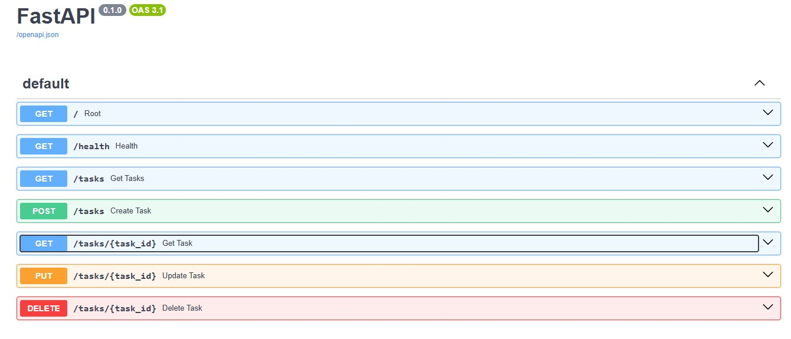
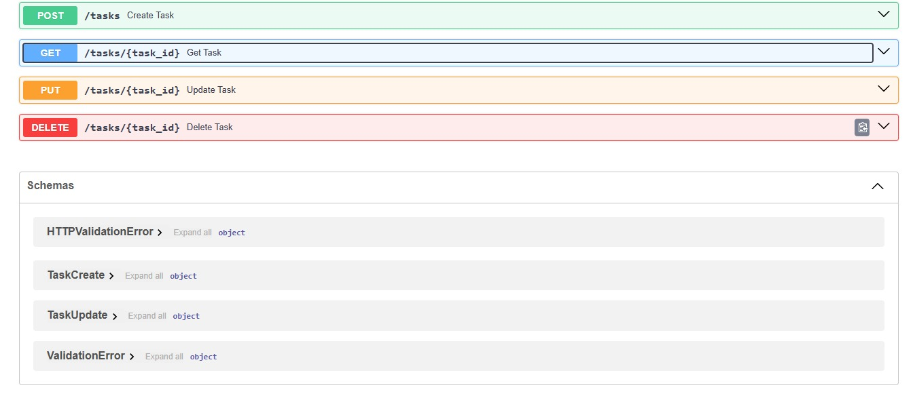

# Task API

A small CRUD (Create, Read, Update, Delete) API for managing a to-do list, built with **FastAPI** and Python.
Data is stored **in memory** — it resets whenever the server restarts (no database yet, that's coming in Week 3).

Built as part of the FlyRank Internship — Backend Track, Week 2, Assignment A1.

---

## How to install & run

**Requirements:** Python 3.10+

```bash
# 1. Clone this repo
git clone https://github.com/AbdulHadi-81/to-do-api.git
cd to-do-api

# 2. Create and activate a virtual environment
python -m venv venv
venv\Scripts\Activate.ps1      # Windows PowerShell
# source venv/bin/activate     # Mac/Linux

# 3. Install dependencies
pip install fastapi uvicorn

# 4. Run the server
uvicorn main:app --reload
```

The server runs at: `http://localhost:8000`

Interactive Swagger docs: `http://localhost:8000/docs`

---

## Endpoints

| Method | Path            | Description                          | Success | Errors        |
|--------|-----------------|---------------------------------------|---------|---------------|
| GET    | `/`             | API info                             | 200     | —             |
| GET    | `/health`       | Health check                         | 200     | —             |
| GET    | `/tasks`        | List all tasks                       | 200     | —             |
| GET    | `/tasks/{id}`   | Get a single task                    | 200     | 404           |
| POST   | `/tasks`        | Create a new task                    | 201     | 400           |
| PUT    | `/tasks/{id}`   | Update a task's title and/or done    | 200     | 400, 404      |
| DELETE | `/tasks/{id}`   | Delete a task                        | 204     | 404           |

---

## Example request

```bash
curl -i -X POST http://localhost:8000/tasks -H "Content-Type: application/json" -d '{"title":"Buy milk"}'
```

**Example response:**
```
HTTP/1.1 201 Created
date: Sat, 18 Jul 2026 19:30:19 GMT
server: uvicorn
content-length: 40
content-type: application/json

{"id":5,"title":"Buy milk","done":false}

---

## Swagger UI

```

```

```

```

---

## Notes on in-memory storage

Because tasks are stored in a Python list (not a database), all data is lost whenever the server restarts.
This is intentional for this stage it's the reason Week 3 introduces a real database.
